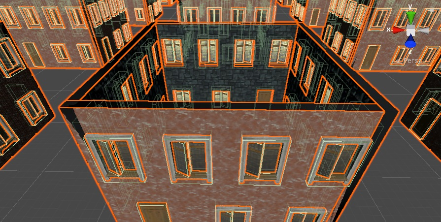
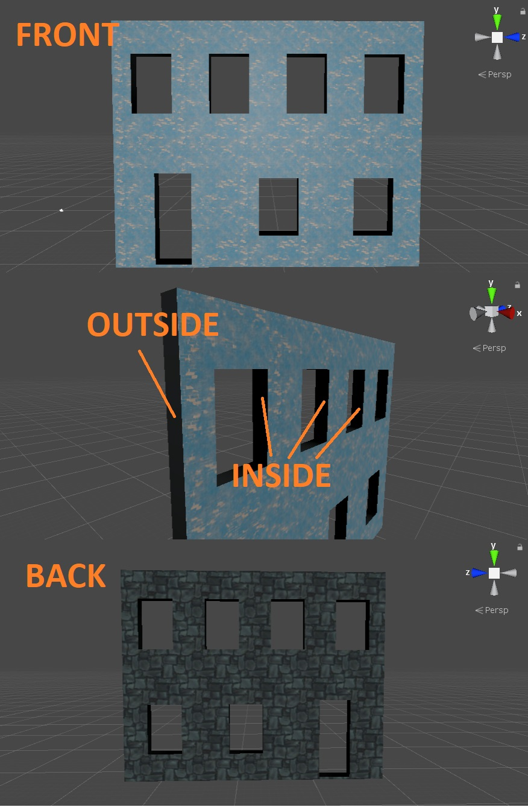
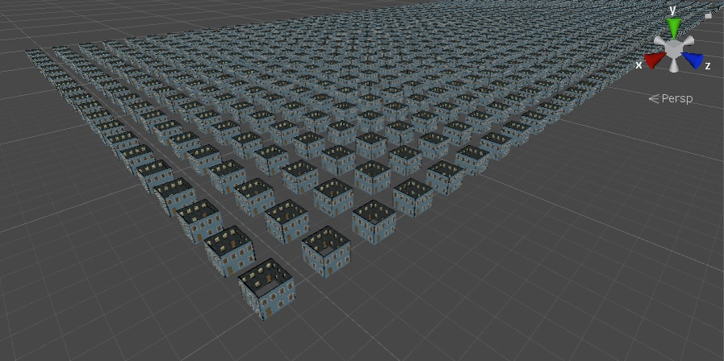

# buildings-generation (work in progress)
## Preface
For some problems algorithms that utilize GPU computational power can be many times more efficient than their CPU equivalents. I think procedural generation is an example of such problem. Here, I try to create a general tool to use CUDA to generate many custom buildings at once, serialize them and instantiate in Unity.
## Possible uses
The code is meant to be easily extensible and provide a base that the logic of specific buildings and modules can be built on. It can be used in games, where time spent on waiting for a world generation is crucial.
## Challenges
* To make custom shapes in Unity (and I need them for custom walls with holes), one must create a Mesh component and perform a triangulation with holes and texturing
* Maximum number of generation operations should be performed on GPU, to avoid extensive memory traffic
* Restricted amount of memory on GPU can become a problem
* To achieve a significant speedup, building and modules of the same type should be computed simultaneously. There must be many buildings and/or modules of the same type to achieve speedup
* Serialization and deserialization speed can be an actual bottleneck and undermine the project purpose
## Results
Project is not yet finished, there are still bugs, especially in the triangulation. The code quality is tragic, but I plan to fix this only after I manage to get things to work
### Building with models

### Triangulation with holes and texturing

### Many buildings
  

Yes, I don't yet have roofs. But I'm working on it.
